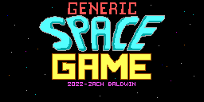

# Generic Space Game



## Program Flow

The overall program flow for the game (in pseudo code) looks like this:

```python
TITLE:
    player = Sprite(PLAYER)

    difficulty = 0

TITLE_INIT:
    player.setPosition(0, 120)

    # Title screen
    while not BUTTONS.FIRE.isPressed():
        displayBackground(title_screen)
        if difficulty > 0:
            drawSpite(thrustors)
            player.moveRight(1)
        player.moveRight(1)

        # Handle blinking
        if frame / 16 == 0:
            player.setState(1)
        else:
            player.setState(2)

        displaySprite(player)

        if BUTTONS.UP.isPressed():
            difficulty += 1
            if difficulty > MAX_DIFFICULTY:
                difficulty = MAX_DIFFICULTY
        elif BUTTONS.DOWN.isPressed():
            difficulty -= 1
            if difficulty < 0:
                difficulty = 0

    while FIRE.isPressed():
        # Busy wait for release
    
INIT:
    lives = 3
    score = 0
    enemy_count = 0
    enemy_spawn_delay = 0
    missiles[2]
    enemies[4]
    explosions[4]

    
    for slot in explosions:
        slot.state = INACTIVE

    NEXT_LIFE:
        rng.seed({frame,line})

        player.setPosition(STARTX, STARTY)

        for slot in missiles:
            slot.state = INACTIVE

        enemy_count = 0

        while True: (ACTIVE_LOOP)
            displayBackground(gameplay_screen)

            [inline] displayLives(lives)

            [inline] drawScore(score)

            [inline] drawEnemies(enemy_count, enemies, frame)

            [inline] drawMissiles(missiles)

            [inline] updateExplosions(explosions)
            [inline] drawExplosions(explosions)

            if lives < 0:
                goto DEATH

            if not player.hasBeenHit():

                [inline] drawPlayer(player, frame)

                [inline] drawPlayerThrusters(frame)

            
            while not hasChanged(frame):
                # Busy wait until next vertical blanking period

            if player.hasBeenHit:
                if player.hitTimer != 0:
                    player.hitTimer -= 1
                    continue (goto ACTIVE_LOOP)
                if player.hitTimer == 0:
                    lives -= 1
                    player.hasBeenHit = False
                    

            enemy_spawn_delay += 1
            
            # if frame % 64 == 0:
            #     updateScore(5)

            if enemy_count < MAX_ENEMIES and enemy_spawn_delay % 64 == 0:
                [inline] spawnNewEnemy(enemies)
                enemy_count += 1

            # Update enemy positions
            for i in range(enemy_count):
                enemies[i].moveLeft(1)
                if enemies[i].getX() == 0:
                    [inline] respawnEnemy(enemies, enemies[i])
                    updateScore(POINTS_ENEMY_PASS)
                if difficulty >= 1 and (frame & 7 == 0):
                    enemies[i].setY(enemies[i].getY() + (RNG() & 1))

                if abs(enemies[i].getX() - player.getX()) < TOLERANCE and abs(enemies[i].getY() < player.getY()):
                    goto PLAYER_HIT

            # Update missile positions
            missiles[0].moveRight(2)
            if missiles[0].getX > LINE_WIDTH - 8: # Past end of frame
                missiles[0].state = INACTIVE
            else:
                checkMissileEnemyCollision(missile[0], enemies, enemy_count, explosions)
                
            missiles[1].moveRight(2)
            if missiles[1].getX > LINE_WIDTH - 8: # Past end of frame
                missiles[1].state = INACTIVE
                updateScore(POINTS_MISS)
            else:
                checkMissileEnemyCollision(missile[1], enemies, enemy_count, explosions)

            if BUTTONS.UP.isPressed():
                if player.getY() > PLAYER_MIN_Y:
                    player.moveUp(1)
            else if BUTTONS.DOWN.isPressed():
                if player.getY() < PLAYER_MAX_Y:
                    player.moveDown(1)
            if BUTTONS.FIRE.isPressed():
                if missiles[0].isInactive():
                    missiles[0].setPosition(player.getPosition())
                if missiles[1].isInactive():
                    missiles[1].setPosition(player.getPosition())
                
                rng.seed += 13

    PLAYER_HIT:
        signalExplosion(player.getX(), player.getY())
        player.hasBeenHit = True # In reality, the explosion 'hit' timer stores this data
        player.hitTimer = PLAYER_EXPLOSION_DELAY
        goto NEXT_LIFE

    DEATH:
        for letter in DEATH_MESSAGE:
            displaySprite(letter, posX, posY)
        
        delay(1000) # About 1 second ?

        while not BUTTONS.FIRE.getEdge():
            # Wait for player to press FIRE
        
        goto INIT # Restart game


### HELPER FUNCTIONS ###

signalExplosions(x, y):
    for slot in explosions:
        if slot.state == INACTIVE:
            slot.setX(X)
            slot.setY(Y)
            slot.setFrameState(EXPLOSION_FRAMES)
            slot.setSprite(SPRITE_EXPLOSION1_DATA) # Frame 1 animation sprite

checkMissileEnemyCollision(missile, enemies, enemy_count, explosions):
    if enemy_count == 0:
        return
    
    for enemy in enemies:
        if abs(enemy.getX() - missile.getX()) < TOLERANCE and abs(enemy.getY() - missile.getY()) < TOLERANCE:
            signalExplosion(enemy.getX(), enemy.getY())
                    
            enemy.state = INACTIVE
            missile.state = INACTIVE
            enemy_count -= 1
            updateScore(100)

    return

bin2bcd(num):
    return num.format(BCD) # Uses "Double dabble" / shift-and-add-3 algorithm

updateScore(delta):
    score += delta
    return


rng:
    seed *= 5
    seed += 3
    return seed


drawBackground(dst_address, src_address):
    for i in range(SCREEN_SIZE, 0, -1):
        *(dst_address + i) = *(src_address + i)

    return


drawSprite(x, y, sprite):
    addr = x + y * LINE_WIDTH

    for i in range(8):
        data = sprite.getData()[i]
        mask = sprite.getMask()[i]

        data = data << (x % 8)  # Shift not present in drawSpriteFast()
        mask = mask << (x % 8)

        sdata = screen_data[addr]
        sdata = sdata & ~mask
        sdata = sdata | data
        screen_data[addr] = sdata


multiply(x, y):
    return x * y # Uses the "optimized" multiplication method
       
```